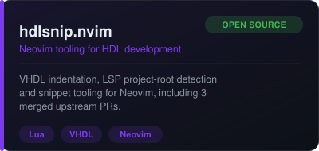
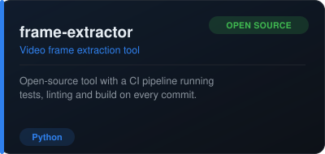
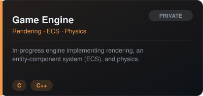
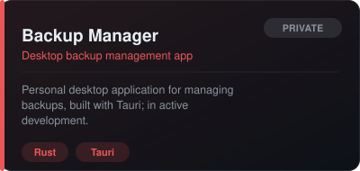

# Hi there, I'm Javier 👋

Industrial engineer with a background in FPGA/VHDL and embedded systems, with
experience as a project/program manager in the space sector. Now working to
transition to the software / embedded industry as an individual contributor
or as a project manager — while also still coding and building side projects.

 

### 🚀 Projects

  
  &nbsp;&nbsp;
  

 

  
  &nbsp;&nbsp;
  

 

### 📫 Get in touch

 

### 🛠️ Languages & Tools

 

### 📊 GitHub Stats

  
  

